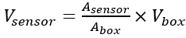
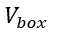
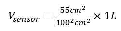
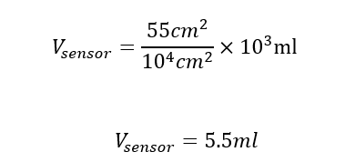
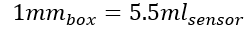
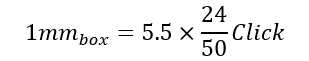
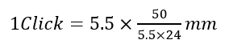
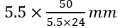

# I'm Singing in the Rain

#### *Components*
1. 1x PCB  5X7 cm(Printed Circuit Board) 
2. 1x PCB 9x15
3. 2x Boxes 
4. 1x FireBeetle 2 ESP32-E
5. 1x botton 
6. 1x Buck convertor 
7. 1x O led screen 
8. 1x Resistor 1K 
9. 1x Rain Sensor   
10. 1x OLED Screen  
11. 1 liter of rain water = 1 Kg (under assumptions)
 sensors: 
12. 1x SHT30 Sensor (Temperature and RH)    
13. 1x Buck Converter

### Rain Sensor Description and Calculation Methodology

The rain sensor we are using operates based on gravity. The sensor consists of a surface that drains water into a small container. Once a certain amount of water accumulates, the container tips due to the weight, producing a clicking sound.

#### Conversion Methodology
We will explain how the number of clicks is converted into milliliters (mL) and subsequently into millimeters (mm).

**Assumptions:**
1. **50 mL = 24 clicks** (experimentally verified in the lab).
2. **1 mL = 24/50 clicks**.

To simplify the calculation, we compare the values obtained to a box with an area of 100 cm² and a height of 1 mm. This box serves as a model for rain falling outside the sensor. The box's volume is 1 liter, meaning that 1 liter of water fully fills the box, creating a 1-mm water layer. Assuming rain has filled the box, we can state:  
**1 L = 1 mm**.

The area of our sensor is:
**5 cm × 11 cm = 55 cm²**.

To determine the amount of water captured by the sensor, we use the ratio of the areas between the box and the sensor:

Where:  

 is the volume of water falling into the box, which is 1 liter.

By substituting the values into the formula:

Simplifying further:

From this calculation, we observe that when 1 mm of rain falls into the box (or 1 liter), the amount of water collected by the sensor is 5.5 mL. Thus, the conversion factor is:

#### Conversion from Clicks to mm
After determining the conversion factor between the rainfall in mm for the box and the volume in mL collected by the sensor, we now convert clicks to mL and subsequently to mm. To do so, we use **Assumption 2**.

Substituting **Assumption 2** into the formula:

Isolating the value per click:

Thus, we find that each click represents:

This calculation provides the conversion rate from clicks to millimeters of rainfall.

---
